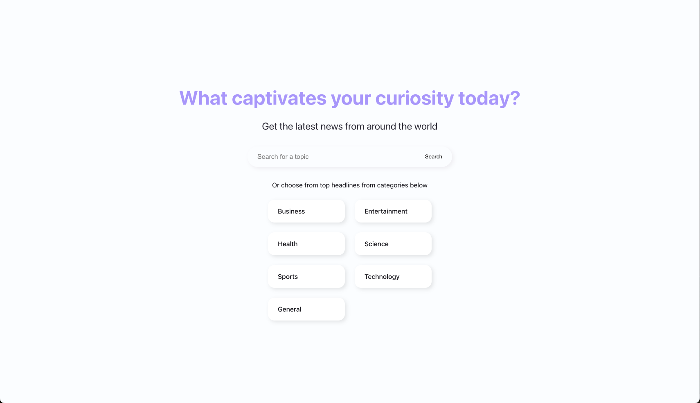

# News Aggregator

News Aggregator is a news aggregator built with React, TypeScript, Vite adn uses the [News API](https://newsapi.org/).

## Instalation Instructions

This codebase uses pnpm as package manager. To install the dependencies, run the following command:
```
pnpm install
```
or alternatively you can use yarn orn npm:
```
yarn install
```
or
```
npm install
```

An example env has been included in the `.env.example` file. Copy the file to `.env` and fill in the values.

## Running the app
### To run the app in development mode, run the following command:
```
npm run dev
```

### To build the app for production and run it in production mode, run the following commands:
```
npm run build
```
and then
```
npm run preview
```

## Running tests
To run the tests, run the following command:
```
npm run test
```

## Design decisions and code structure
I’ve built this app using React with TypeScript to ensure type safety and maintainability. TypeScript enhances the development experience by providing autocompletion and preventing type-related errors. The directory structure is thoughtfully organized to facilitate easy navigation and maintain a well-structured codebase, contributing to a smooth developer experience and minimizing confusion. The code structure adheres to [atomic design principles](https://atomicdesign.bradfrost.com/chapter-2/)) for better component organization and reusability. In the absence of a UI design file, I aimed to keep the design straightforward, prioritizing functionality and layout. To prevent className conflicts, I utilized style modules. The app's layout is designed to be responsive and works well across three device types: mobile, tablet, and desktop. All the colors used are css variables and have been declared in index.css file.

## Assumptions and trade-offs
- Initially there was a disparity between the news API and the app's requirements. Two different api endpoints have been used and distributed between the two pages. Although the app consists of three pages in total(Home, Search and Category). 

  - /everything endpoint
    While this endpoint allows for sorting by relevance, it does not provide any filtering options. This endpoint has been used to implement the `search` page.

  - /top-headlines endpoint
    While this endpoint provides filtration options, it does not allow for sorting options. This endpoint has been used to implement the `category` page.

- The news api on a developer plan is limited to 100 articles. If there are pages beyond the first 100 articles the application will error out.

- There are some articles that do not have an image or a broken link. I have used a placeholder image for these articles.

- Most of the articles that are returned from the top-headlines endpoint do not have an image(used fallback image here) and neither do they have a description/content returned. Please use the search page to check the collapsible description feature.

## Screenshots

### Home page



### Search page


### Category page
